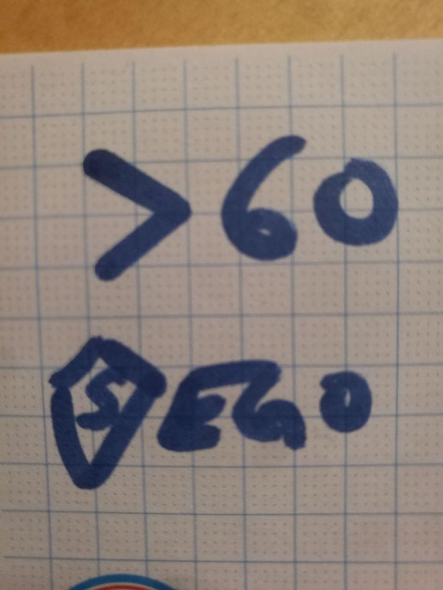

Are dinner jokes allowed to become git-revisioned repositories? yes they do!

### What is 60+$ego?

**60+$ego** (pronounce *60 something; superego*) is a meme to define a succesessful (or not even succesessful) person with a big ego and an age over 60. A way to catharsis.

### What can you do?

Whenever you need it you can download the svg file and adapt this to your needs. If you pull request we'll manage to add you.

Early examples of the phenomena:

Peter

Peter Again (whatsapp chat)

Gomba first attempt

The Pill (I kinda stick with this for a while)

